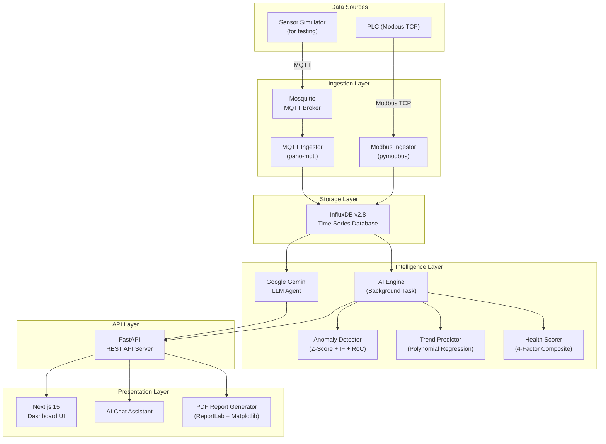
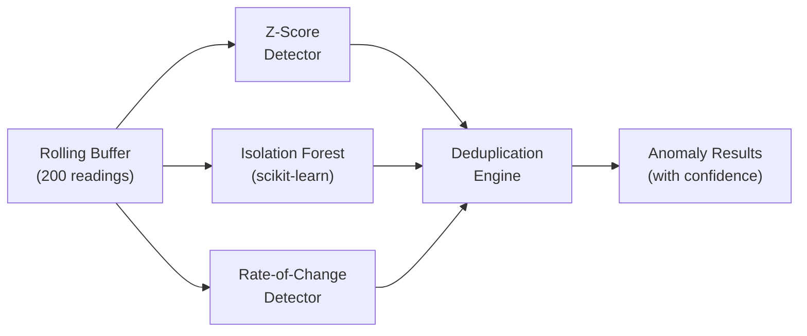
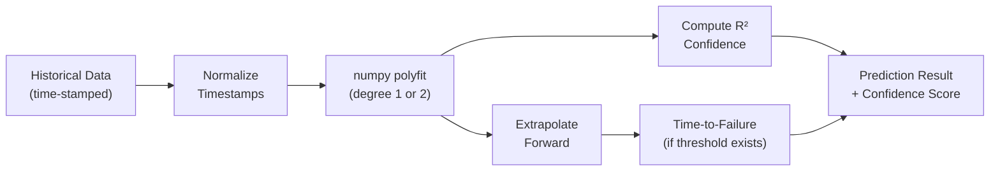

# ELECSOL AI-Based SCADA Platform
## Stakeholder Demo & Presentation Document

**Prepared by:** ELECSOL Engineering Team
**Date:** March 2026
**Version:** 1.0
**Classification:** Internal / Stakeholder Review

---

## Table of Contents
1. [Executive Summary](#1-executive-summary)
2. [Problem Statement](#2-problem-statement)
3. [Solution Overview](#3-solution-overview)
4. [System Architecture](#4-system-architecture)
5. [Technology Stack](#5-technology-stack)
6. [Data Pipeline — How Data Flows](#6-data-pipeline--how-data-flows)
7. [Feature Breakdown](#7-feature-breakdown)
8. [AI & Machine Learning Methodology](#8-ai--machine-learning-methodology)
9. [Database Strategy](#9-database-strategy)
10. [Business Case & ROI](#10-business-case--roi)
11. [Deployment Strategy](#11-deployment-strategy)
12. [Security & Compliance](#12-security--compliance)
13. [Roadmap & Future Enhancements](#13-roadmap--future-enhancements)
14. [Live Demo Script](#14-live-demo-script)
15. [Master Prompt for PPT Generation](#15-master-prompt-for-ppt-generation)

---

## 1. Executive Summary

The **ELECSOL AI-Based SCADA Platform** is a next-generation industrial monitoring and analytics system that **retrofits onto any existing factory SCADA infrastructure** to provide:

- **Real-time machine monitoring** across 20+ industrial assets simultaneously
- **AI-powered anomaly detection** using three independent ML algorithms
- **Predictive maintenance** with time-to-failure forecasting
- **Conversational AI Co-Pilot** (powered by Google Gemini) that operators can ask questions in plain English
- **Automated PDF shift reports** with embedded trend charts
- **Health scoring** with A-F grading for every machine and the entire plant

**The key innovation:** This platform does NOT replace the existing factory SCADA system. It **sits alongside it** as an intelligent overlay, reading data from PLCs via standard industrial protocols (Modbus TCP) and providing AI-driven insights that legacy SCADA systems simply cannot offer.

---

## 2. Problem Statement

### What Factories Have Today
Traditional SCADA systems in Indian factories (and globally) provide:
- ✅ Basic real-time visualization (HMI screens)
- ✅ Simple alarm triggering (threshold-based: "if temperature > 85°C, ring alarm")
- ✅ Historical data logging (to proprietary databases)

### What They LACK
- ❌ **No predictive capability** — Alarms only fire AFTER the problem has occurred
- ❌ **No anomaly intelligence** — Can't detect subtle patterns that precede failures
- ❌ **No natural language interface** — Operators must navigate complex menus
- ❌ **No automated reporting** — Shift reports are written manually on paper
- ❌ **No health scoring** — No way to quickly assess overall plant health
- ❌ **No trend intelligence** — Can see trends on screen, but no AI to interpret them

### The Cost of Reactive Maintenance
| Metric | Reactive (Current) | Predictive (Our Solution) |
|---|---|---|
| Unplanned downtime | 800+ hours/year | Reduced by 30-50% |
| Maintenance cost | ₹15-25 lakhs/year | Reduced by 20-40% |
| Equipment lifespan | Shortened by 15-20% | Extended by 15-25% |
| Energy waste | 10-15% overconsumption | Optimized via early detection |

---

## 3. Solution Overview

### The "Side Hero" Architecture
Our platform is designed as a **"side hero"** to the existing SCADA system — not a replacement:

```
┌─────────────────────────────────────────────────────┐
│                  FACTORY FLOOR                       │
│                                                     │
│   ┌──────┐  ┌──────┐  ┌──────┐  ┌──────────────┐   │
│   │Motor │  │Pump  │  │Comp. │  │ Existing     │   │
│   │  1   │  │  1   │  │  1   │  │ SCADA HMI    │   │
│   └──┬───┘  └──┬───┘  └──┬───┘  │ (untouched)  │   │
│      │        │         │      └──────┬───────┘   │
│      └────────┼─────────┘             │           │
│               │                       │           │
│          ┌────▼────┐            ┌─────▼─────┐     │
│          │   PLC   │◄──────────►│ Existing  │     │
│          │(Siemens,│            │ SCADA     │     │
│          │ ABB,etc)│            │ Server    │     │
│          └────┬────┘            └───────────┘     │
│               │                                   │
│               │ Modbus TCP / Ethernet              │
│               │                                   │
│  ┌────────────▼──────────────────────────────┐    │
│  │     ELECSOL AI SCADA PLATFORM             │    │
│  │     (Our Solution - runs on a PC/Server)  │    │
│  │                                           │    │
│  │  ┌─────────┐ ┌──────────┐ ┌───────────┐  │    │
│  │  │InfluxDB │ │ AI Engine│ │ Web       │  │    │
│  │  │(Time-   │ │ (ML +    │ │ Dashboard │  │    │
│  │  │ Series) │ │ Gemini)  │ │ (Next.js) │  │    │
│  │  └─────────┘ └──────────┘ └───────────┘  │    │
│  └───────────────────────────────────────────┘    │
└─────────────────────────────────────────────────────┘
```

**Key point:** The existing SCADA system, HMI panels, and PLC programs remain completely untouched. Our platform simply reads data from the same PLC over a standard Modbus TCP connection.

---

## 4. System Architecture

### Component Architecture



---

## 5. Technology Stack

### Why Each Technology Was Chosen

| Layer | Technology | Why This? |
|---|---|---|
| **PLC Communication** | pymodbus (Modbus TCP) | Industry standard protocol — works with Siemens, ABB, Schneider, Delta, Allen-Bradley PLCs |
| **Message Broker** | Mosquitto (MQTT) | Lightweight IoT-standard pub/sub — handles thousands of messages/sec with negligible overhead |
| **Time-Series DB** | InfluxDB v2.8 | Purpose-built for sensor data — handles millions of data points with sub-millisecond queries. Used by Tesla, IBM, Netflix for IoT |
| **Backend API** | FastAPI (Python) | Async-first, auto-generates OpenAPI docs, native Python ML library integration |
| **AI/ML** | NumPy, scikit-learn | Industry-standard scientific computing and ML libraries |
| **LLM Agent** | Google Gemini (gemini-1.5-flash) | Tool-calling capability enables the AI to query live data, not hallucinate |
| **Frontend** | Next.js 15 (React) | Server-side rendering for SEO + real-time updates via polling |
| **PDF Reports** | ReportLab + Matplotlib | Professional-grade PDF generation with embedded vector charts |
| **Configuration** | YAML + .env | Human-readable config with secure secret management |

---

## 6. Data Pipeline — How Data Flows

### Step-by-Step Data Journey

**Step 1: Physical Sensor → PLC**
- Analog sensors (thermocouples, pressure transducers, accelerometers) wired to PLC analog input modules.
- PLC firmware converts raw 4-20mA / 0-10V signals to engineering units and stores them in **holding registers**.

**Step 2: PLC → Our Platform (Modbus TCP)**
- Our `modbus_ingestor.py` connects to the PLC's Ethernet port via **Modbus TCP** (port 502).
- Every 2 seconds, it reads the configured holding register addresses (e.g., Register 40001 = MOTOR_1 temperature).
- Raw register values are scaled using configurable scaling factors (e.g., `register_value × 0.1 = °C`).

**Step 3: Ingestion → InfluxDB**
- Scaled values are written to InfluxDB as **time-series data points** with:
  - **Measurement:** `machine_metrics`
  - **Tags:** `machine_id` (e.g., "MOTOR_1", "COMPRESSOR_1")
  - **Fields:** temperature, vibration, pressure, speed, etc.
  - **Timestamp:** Nanosecond-precision UTC timestamp

**Step 4: InfluxDB → AI Engine (Every 5 Seconds)**
- The AI Engine runs as a **background async task** inside the FastAPI server.
- Every 5 seconds, it:
  1. Queries InfluxDB for the latest readings across all machines
  2. Appends values to a **rolling buffer** (last 200 readings per machine/metric)
  3. Runs **anomaly detection** (3 algorithms simultaneously)
  4. Runs **trend prediction** (polynomial regression with R² confidence)
  5. Computes **health scores** (4-factor weighted composite)
  6. Publishes results to in-memory stores consumed by API endpoints

**Step 5: API → Dashboard**
- Frontend polls the FastAPI REST API every few seconds.
- Dashboard widgets render live gauges, trend charts, anomaly alerts, and health grades.

---

## 7. Feature Breakdown

### 7.1 Real-Time Dashboard
- **Machine Cards:** Live temperature, pressure, vibration for each machine
- **Trend Charts:** Rolling time-series with 1-minute aggregation windows
- **System Health Score:** Overall plant health grade (A–F) with per-machine breakdown
- **Active Alarms Panel:** Real-time alarm feed with severity indicators

### 7.2 AI-Powered Anomaly Detection
- **Three independent detectors** running in parallel
- **Deduplication engine** ensures the same anomaly isn't reported multiple times
- **TTL (Time-to-Live)** — anomalies automatically expire after 60 seconds if the condition resolves
- **Confidence scores** — each anomaly comes with a 0–100% confidence rating

### 7.3 Predictive Maintenance
- **Time-to-Failure (TTF) Estimation:** "MOTOR_1 temperature will breach the high alarm in approximately 22 minutes"
- **Trend Direction Analysis:** Rising / Falling / Stable classification per metric
- **Z-Score Anomaly Scoring:** How many standard deviations from normal?
- **Threshold Proximity Alerts:** "COMPRESSOR_1 vibration is within 10% of the alarm limit"

### 7.4 AI Chat Co-Pilot (Gemini-Powered)
- **Natural language queries:** "What is the current temperature of Motor 1?"
- **Health analysis:** "Analyze the health of COMPRESSOR_1"
- **Failure prediction:** "When will MOTOR_1 overheat?"
- **Report generation:** "Generate a shift report for the last 8 hours"
- **Active alarms:** "Are there any active alarms?"
- **Trend charts:** "Show me a temperature chart for PUMP_1"

The AI uses **tool-calling** — it doesn't guess or hallucinate numbers. When you ask "What is the temperature of Motor 1?", Gemini calls a real Python function that executes an InfluxDB query and returns the actual value.

### 7.5 Automated PDF Shift Reports
- **Professional PDF Generation:** Cover page, machine summary table, alarm log, embedded trend charts
- **One-Click Download:** AI generates the report and provides a download link in the chat
- **Customizable Shift Duration:** Default 8 hours, configurable

### 7.6 Multi-Machine Support
- Supports **20+ simultaneous machines** out of the box
- Currently configured: Motor 1/2, Pump 1/2, Compressor 1/2, Conveyor 1/2, Oven 1/2, Boiler 1, Chiller 1, CNC 1, Extruder 1, Generator 1, Mixer 1, Press 1, Robot 1

---

## 8. AI & Machine Learning Methodology

### 8.1 Anomaly Detection Pipeline



| Algorithm | Type | How It Works | When It Triggers |
|---|---|---|---|
| **Z-Score** | Statistical | Computes `Z = (x − μ) / σ` on rolling window | `|Z| > 2.5` (configurable) |
| **Isolation Forest** | Unsupervised ML | Randomly partitions data; anomalies isolate faster | Model score < threshold |
| **Rate-of-Change** | First Derivative | `ΔV/Δt` exceeds parameter-specific limits | Rapid spike detected |

### 8.2 Trend Prediction Pipeline



### 8.3 Health Scoring Formula

```
Machine Health Score (0-100) =
    Threshold Distance  × 0.40    ← How far from danger?
  + Anomaly Penalty     × 0.30    ← Any anomalies detected?
  + Signal Stability    × 0.20    ← Is the reading steady?
  + Rate Calmness       × 0.10    ← Any rapid changes?

Grade Mapping:
  A = 90-100  |  B = 75-89  |  C = 60-74  |  D = 40-59  |  F = 0-39
```

---

## 9. Database Strategy

### Why InfluxDB?

| Requirement | InfluxDB Capability |
|---|---|
| Write 20+ metrics every 2 seconds | Handles 1M+ writes/sec |
| Query last 30 minutes of data | Sub-millisecond query performance |
| Retain months of historical data | Built-in retention policies |
| Aggregate data for charts | Native `aggregateWindow()` function |
| Tag-based filtering | First-class tag indexing (machine_id) |

### Data Schema

```
Measurement: machine_metrics
Tags: machine_id (e.g., "MOTOR_1", "COMPRESSOR_1")
Fields: temperature, vibration, pressure, speed, flow_rate, power_draw
Timestamp: nanosecond-precision UTC

Measurement: alarms
Tags: machine_id, severity
Fields: message
Timestamp: nanosecond-precision UTC
```

### Retention Policy
- **Default:** 30 days at full resolution
- **Downsampled:** 1-year at 1-hour aggregation (configurable)

---

## 10. Business Case & ROI

### Cost-Benefit Analysis

| Item | Cost |
|---|---|
| **Hardware Required** | 1× Windows PC or small server (₹30,000 - ₹80,000) |
| **Software Licenses** | ₹0 (all open-source: InfluxDB OSS, Python, Next.js) |
| **Gemini API** | ₹0 (free tier: 15 RPM, sufficient for single-plant) |
| **Implementation** | 2-4 weeks by ELECSOL engineering team |
| **Annual Maintenance** | Minimal (software updates only) |
| **Total Year-1 Cost** | **₹50,000 - ₹1,50,000** |

### Expected Savings

| Benefit | Estimated Annual Saving |
|---|---|
| Reduced unplanned downtime (30-50% reduction) | ₹5,00,000 - ₹15,00,000 |
| Lower maintenance costs (predictive vs. reactive) | ₹3,00,000 - ₹8,00,000 |
| Reduced energy waste (early anomaly detection) | ₹1,00,000 - ₹3,00,000 |
| Eliminated manual reporting (automated PDF) | ₹50,000 - ₹1,00,000 (labor hours) |
| **Total Annual Saving** | **₹9,50,000 - ₹27,00,000** |

### ROI = 6× to 18× in Year 1

---

## 11. Deployment Strategy

### How It Integrates with Existing Factory SCADA

#### Pre-Requisites
1. ✅ Factory has a PLC with an Ethernet port (Modbus TCP-capable)
2. ✅ PLC stores sensor data in holding registers
3. ✅ A Windows PC/server connected to the same network as the PLC

#### Deployment Steps

| Step | Action | Duration |
|---|---|---|
| 1 | **Network Survey:** Identify PLC IP, port, register map | 1-2 hours |
| 2 | **Install Platform:** Copy software + install InfluxDB | 30 minutes |
| 3 | **Configure Registers:** Map PLC registers to machine IDs in `settings.yaml` | 1-2 hours |
| 4 | **Configure Alarms:** Set threshold values per metric | 30 minutes |
| 5 | **Test Connection:** Verify data flow from PLC → InfluxDB → Dashboard | 1 hour |
| 6 | **Train Operators:** Show dashboard + AI Assistant usage | 2-3 hours |
| **Total** | | **1-2 days** |

#### What Does NOT Change
- ❌ No changes to PLC programs
- ❌ No changes to existing SCADA HMI panels
- ❌ No rewiring of sensors
- ❌ No downtime required for installation
- ❌ No changes to existing alarm systems

#### What Gets Added
- ✅ AI-powered anomaly detection
- ✅ Predictive maintenance forecasting
- ✅ Natural language AI assistant
- ✅ Modern web dashboard accessible from any browser
- ✅ Automated PDF shift reports
- ✅ Plant-wide health scoring

### Scaling to Multiple Plants

The platform can be deployed across multiple plants:
1. **Option A: Local Instance per Plant** — Each plant has its own server running the full stack
2. **Option B: Cloud Aggregation** — Edge devices at each plant push data to a central cloud instance for cross-plant analytics

---

## 12. Security & Compliance

| Area | Implementation |
|---|---|
| **API Keys** | Stored in `.env` file, never in source code |
| **InfluxDB Auth** | Token-based authentication (API tokens) |
| **Network** | Platform connects to PLC on local industrial network (air-gapped from internet) |
| **Data Privacy** | All data stays on-premises (no cloud upload required) |
| **User Access** | Protected routes with authentication (extensible to LDAP/AD) |

---

## 13. Roadmap & Future Enhancements

| Phase | Feature | Timeline |
|---|---|---|
| **Phase 2** | Mobile app (React Native) for on-the-go monitoring | Q2 2026 |
| **Phase 2** | PLC write-back commands via AI ("AI, turn off Motor 1") | Q2 2026 |
| **Phase 3** | Deep learning anomaly detection (LSTM autoencoders) | Q3 2026 |
| **Phase 3** | Multi-plant cloud aggregation dashboard | Q3 2026 |
| **Phase 4** | Digital twin visualization (3D factory model) | Q4 2026 |
| **Phase 4** | Integration with SAP ERP for automated work orders | Q4 2026 |

---

## 14. Live Demo Script

### Demo Flow (15-20 minutes)

**Act 1: The Problem (2 min)**
- Show a traditional SCADA HMI screenshot
- "This is what factories see today — numbers on a screen, alarms that ring too late"

**Act 2: The Dashboard (5 min)**
1. Open `http://localhost:3000` — show the modern web dashboard
2. Point out live machine cards with real-time data
3. Click into a machine — show trending charts
4. Show the system health score and explain the grading

**Act 3: The AI Co-Pilot (5 min)**
1. Navigate to `http://localhost:3000/ai-assistant`
2. Ask: *"What is the current status of all machines?"*
3. Ask: *"Analyze the health of MOTOR_1"* — show the statistical analysis
4. Ask: *"When will COMPRESSOR_1 overheat?"* — show the TTF prediction
5. Ask: *"Generate a shift report"* — click the download link, open the PDF

**Act 4: Under the Hood (3 min)**
- Show the architecture diagram
- Explain: "All of this runs on a single PC, reading from your existing PLC. No changes to your factory."

**Act 5: Business Impact (3 min)**
- Show the ROI slide
- "For under ₹1.5 lakhs, you get capabilities that ₹50 lakh SCADA upgrades don't provide"

---

## 15. Master Prompt for PPT Generation

> Copy and paste this entire prompt into **Gamma.app**, **Beautiful.ai**, **Presentations.AI**, **SlidesGPT**, or any AI presentation tool:

---

```
Create a professional, modern, dark-themed corporate presentation (20-25 slides) for the following product pitch. Use a color scheme of deep navy blue (#0F172A) with electric blue (#3B82F6) accents and white text. Include data visualizations, architecture diagrams, and comparison tables where appropriate.

TITLE SLIDE:
"ELECSOL AI-Based SCADA Platform — Intelligent Industrial Monitoring & Predictive Maintenance"
Subtitle: "Retrofit AI Intelligence onto Any Existing Factory SCADA System"
Company: ELECSOL | Date: March 2026

SLIDE 2 - THE PROBLEM:
Traditional SCADA systems in factories provide basic monitoring but ZERO predictive capability. Alarms only fire AFTER failures occur. Operators write shift reports manually. No AI, no intelligence, no foresight. Show a comparison table: "What Factories Have Today" vs "What They Need" with checkmarks and crosses.

SLIDE 3 - THE COST OF REACTIVE MAINTENANCE:
Show statistics: 800+ hours/year unplanned downtime, ₹15-25 lakhs/year maintenance costs, 15-20% shortened equipment lifespan. Use impactful large numbers with icons.

SLIDE 4 - OUR SOLUTION:
"AI-Powered SCADA Co-Pilot that retrofits onto existing factory infrastructure." Key message: NO changes to PLC, NO rewiring, NO downtime for installation. It reads data from the same PLC and adds AI intelligence.

SLIDE 5 - ARCHITECTURE OVERVIEW:
Show a layered architecture diagram: Physical Sensors → PLC → Modbus TCP → Our Platform (InfluxDB + AI Engine + Web Dashboard). Emphasize the "side hero" concept — our platform sits alongside the existing SCADA.

SLIDE 6 - DATA PIPELINE:
Step-by-step flow: Sensor → PLC Register → Modbus TCP Read (every 2 sec) → InfluxDB Write → AI Engine Analysis (every 5 sec) → Dashboard Visualization. Show this as a horizontal pipeline with arrows.

SLIDE 7 - TECHNOLOGY STACK:
Table with: pymodbus (PLC communication), InfluxDB (time-series database), FastAPI (backend), NumPy + scikit-learn (ML), Google Gemini (AI agent), Next.js (frontend), ReportLab (PDF reports). Include "Why this?" column.

SLIDE 8 - FEATURE: REAL-TIME DASHBOARD:
Screenshot placeholder. Modern web dashboard showing 20 machines simultaneously with live gauges, trend charts, and health scores. Accessible from any browser on any device.

SLIDE 9 - FEATURE: AI ANOMALY DETECTION:
Three parallel detection algorithms: (1) Z-Score — statistical outlier detection, (2) Isolation Forest — unsupervised ML, (3) Rate-of-Change — catches rapid spikes. Show these as three parallel arrows converging into a "Deduplication Engine."

SLIDE 10 - FEATURE: PREDICTIVE MAINTENANCE:
"Know BEFORE it breaks." Time-to-Failure estimation using polynomial regression. Example: "MOTOR_1 temperature will breach alarm in 22 minutes." Show a trend line graph with a dotted extrapolation line crossing a red threshold.

SLIDE 11 - FEATURE: HEALTH SCORING:
4-factor weighted composite score (0-100): Threshold Distance (40%), Anomaly Penalty (30%), Signal Stability (20%), Rate Calmness (10%). Grades: A/B/C/D/F. Both per-machine and system-wide.

SLIDE 12 - FEATURE: AI CHAT CO-PILOT:
Powered by Google Gemini with tool-calling. Operators ask in plain English: "Analyze health of Motor 1", "When will Compressor 1 overheat?", "Generate shift report." The AI calls real functions that query live data — no hallucination.

SLIDE 13 - FEATURE: AUTOMATED PDF REPORTS:
One-click shift report generation with: cover page, machine summary table, alarm log, embedded matplotlib trend charts. Downloaded directly from the chat interface.

SLIDE 14 - AI METHODOLOGY - ANOMALY DETECTION:
Technical deep-dive: Z-Score formula (Z = (x−μ)/σ, threshold: |Z| > 2.5), Isolation Forest (scikit-learn, contamination: 5%, refit every 100 samples), Rate-of-Change (ΔV/Δt thresholds per parameter).

SLIDE 15 - AI METHODOLOGY - TREND PREDICTION:
Technical deep-dive: numpy polyfit (degree 1-2), R² confidence scoring, threshold ETA calculation (solve regression line for alarm crossing point). "Not gimmicky — real statistical ML."

SLIDE 16 - DATABASE: WHY INFLUXDB:
Time-series optimized: 1M+ writes/sec, sub-ms queries, built-in aggregation, retention policies, tag-based indexing. Used by Tesla, IBM, Netflix for IoT. Comparison vs PostgreSQL for time-series workloads.

SLIDE 17 - DEPLOYMENT STRATEGY:
"Install in 1-2 days, zero factory downtime." Steps: Network survey → Install platform → Map PLC registers → Configure alarms → Test → Train operators. Emphasize: NO changes to PLC programs, NO rewiring, NO existing system modifications.

SLIDE 18 - INTEGRATION WITH EXISTING SCADA:
Diagram showing: Existing SCADA system (untouched) ←→ PLC ←→ Our Platform (new addition). Both systems read from the same PLC simultaneously. The factory doesn't lose anything — they only GAIN intelligence.

SLIDE 19 - BUSINESS CASE & ROI:
Cost: ₹50K-1.5L (Year 1). Savings: ₹9.5L-27L/year (reduced downtime, lower maintenance, energy optimization, automated reporting). ROI: 6× to 18× in Year 1. Show this as a bar chart.

SLIDE 20 - SECURITY & COMPLIANCE:
On-premises data (no cloud required), token-based InfluxDB auth, .env secret management, air-gapped industrial network, extensible to LDAP/Active Directory authentication.

SLIDE 21 - SCALING ACROSS PLANTS:
Option A: Local instance per plant. Option B: Cloud aggregation for cross-plant analytics. Show a map of India with multiple factory pins connected to a central dashboard.

SLIDE 22 - PRODUCT ROADMAP:
Timeline: Phase 2 (Q2 2026) — Mobile app + PLC write-back commands. Phase 3 (Q3 2026) — LSTM deep learning + multi-plant cloud. Phase 4 (Q4 2026) — Digital twin + SAP ERP integration.

SLIDE 23 - COMPETITIVE ADVANTAGE:
Table comparing us vs. Siemens MindSphere, GE Predix, AVEVA PI: Our solution costs <₹2L vs ₹50L+, deploys in days vs months, runs on-premises vs cloud-only, works with any PLC brand vs vendor lock-in.

SLIDE 24 - LIVE DEMO:
"Let us show you the platform in action." QR code or URL to the live demo instance.

SLIDE 25 - THANK YOU & NEXT STEPS:
Contact information. Call to action: "Schedule a pilot deployment at your factory." ELECSOL logo and tagline.

DESIGN NOTES:
- Use a dark, premium theme (navy/black background, blue accents)
- Include icons for each feature (gear for maintenance, brain for AI, chart for trends)
- Use large, impactful numbers for statistics
- Include subtle gradient overlays and glassmorphism effects
- Use Inter or Outfit font family
- Keep text minimal on slides — use speaker notes for details
- Include data visualization placeholders where described
```

---

> **End of Stakeholder Document**
